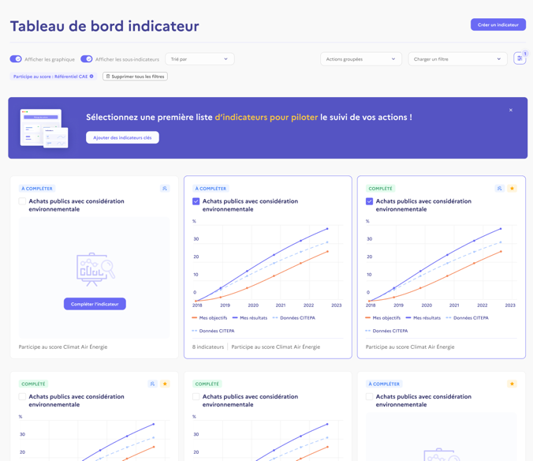

# Test technique 1/2

Le test technique à faire en asynchrone. On pense que le test devrait prendre 1h ou 2h environ selon ton approche.

## Prérequis
- Installer [Supabase CLI](https://supabase.com/docs/guides/cli/getting-started)

## Commencer
 
- Cloner ce dépôt
- Lancer le projet avec :
```shell
supabase start
```
            
## Description du mini projet

Ce projet représente une version simplifiée de notre API indicateur, elle permet pour la collectivité dont on est membre de :
- CRUD des valeurs pour les indicateurs prédéfinis.
- CRUD des indicateurs personnalisés
- CRUD des valeurs pour les indicateurs personnalisés.

Comme sur l'app territoires en transitions, on a un utilisateur de test rattaché à la collectivité #1.
- email: `yolo@dodo.com` 
- password `yolododo`
             

## Instructions

On veut désormais afficher des trajectoires de référence provenant de différents organismes avec des résultats et objectifs importés.



Tu devras faire en sorte que l'on puisse stocker les données suivantes afin de pouvoir les importer pour les indicateurs prédéfinis :
- Des valeurs de résultats
- Des valeurs d’objectifs
- La source de ces valeurs

Exemple de valeur importée :
- Les émissions de GES depuis la source CITEPA.
            
## Todo
Pour ce faire, tu devras :
- Modifier la base de données en vue de permettre les imports de données de sources externes.

Et faire des appels à l’API Supabase REST avec la méthode de ton choix, afin :

- De montrer comment le front pourrait :
  1. Afficher la liste des collectivités dont on est membre
  2. Afficher la liste des indicateurs prédéfinis et des indicateurs personnalisés pour une collectivité
  3. Afficher l’indicateur X pour la collectivité Y avec ses valeurs saisies et ses valeurs importées
  4. Mettre à jour une valeur saisie

- De montrer comment l’admin pourrait
  1. Importer des valeurs pour les mettre à disposition

Le résultat de ton travail servira de support à une conversation. 

La façon dont tu composes ton API est importante.
